# Worship Wheel — User Flow

**Last updated:** 2026-05-26
**Owner:** Derick · derick@swaydeandco.com
**Purpose:** End-to-end helicopter view of how a guitarist enters the Worship Wheel, completes the assessment, receives results, and lands in Keap. Use this to walk any Worship Guitar Skills team member through the system.

---

## At a glance

```mermaid
flowchart LR
  %% ── 1 · ENTRY ──────────────────────────────────────────
  subgraph S1["1 · ENTRY"]
    direction TB
    A1["A1 · TRAFFIC<br/><b>Traffic sources</b><br/>Direct · email · social · paid · partner<br/>UTM captured · page_view fires"]
    A2["A2 · PAGE<br/><b>Landing page</b><br/>worshipwheel.worshipguitarskills.com<br/>CTA: ‘Start the Assessment →’"]
    A3["A3 · USER ACTION<br/><b>Clicks Start the Assessment</b><br/>→ GET /assessment<br/>anonSessionId (UUID v4) stored"]
    A1 --> A2 --> A3
  end

  %% ── 2 · ASSESSMENT ─────────────────────────────────────
  subgraph S2["2 · ASSESSMENT"]
    direction TB
    B1["B1 · QUESTION LOOP<br/><b>24 questions — one per screen</b><br/>3 types × 8 elements = 24<br/>Auto-advance 400 ms · events: started / viewed / answered"]
    B2["B2 · EMAIL GATE<br/><b>Name + email + consent</b><br/>Consent checkbox required (3e30d79)<br/>Submit disabled until ticked"]
    B3["B3 · USER ACTION<br/><b>Submits the assessment</b><br/>POST /api/submit<br/>{firstName, email, answers, anonSessionId, utmParams}"]
    B1 --> B2 --> B3
  end

  %% ── 3 · SUBMIT ─────────────────────────────────────────
  subgraph S3["3 · SUBMIT"]
    direction TB
    C1["C1 · API<br/><b>POST /api/submit</b><br/>Zod validates payload<br/>Per-IP rate-limited"]
    C2["C2 · SCORING<br/><b>Score → 8 elements + archetype</b><br/>overallScore · overallPercentage · balanceScore<br/>Archetype defaults to 'balanced_beginner' (never null)"]
    C3["C3 · DATABASE<br/><b>Write to Supabase</b><br/>assessment_sessions + assessment_events<br/>keap_sync_status = 'pending'"]
    C4["C4 · KICK-OFF<br/><b>Fire-and-forget → Keap sync</b><br/>void syncSessionToKeap(resultId)<br/>API returns 200 immediately"]
    C1 --> C2 --> C3 --> C4
  end

  %% ── 4 · RESULTS ────────────────────────────────────────
  subgraph S4["4 · RESULTS"]
    direction TB
    D1["D1 · PAGE<br/><b>Lands on /results</b><br/>Reads sessionStorage['worshipWheelResult']<br/>Empty state if absent"]
    D2["D2 · RENDER<br/><b>Radar · archetype · 8 elements</b><br/>Chart.js radar + element bars<br/>CTA · share · PDF buttons"]
    D3["D3 · PDF EXPORT<br/><b>Downloads PDF report</b><br/>GET /api/results/[resultId]/pdf<br/>@react-pdf/renderer · event: pdf_downloaded"]
    D1 --> D2 --> D3
  end

  %% ── 5 · KEAP / POST ────────────────────────────────────
  subgraph S5["5 · KEAP / POST"]
    direction TB
    E1["E1 · UPSERT<br/><b>PUT /v1/contacts — upsert by email</b><br/>duplicate_option: 'Email'<br/>Sends given_name + email + custom_fields"]
    E2["E2 · TAGS<br/><b>Apply ‘Worship Wheel · Completed’ tag</b><br/>POST /v1/contacts/{id}/tags<br/>KEAP_TAG_WW_COMPLETED"]
    E3["E3 · CUSTOM FIELDS<br/><b>Write four custom fields</b><br/>Archetype · Results URL<br/>Overall Score · Overall %"]
    E4["E4 · STATUS<br/><b>Write back sync status</b><br/>keap_sync_status: synced / failed<br/>Surfaced in Admin · Sync Health"]
    E5["E5 · KEAP CRM<br/><b>Downstream automations</b><br/>Owned by Charl (no app code)<br/>Tag → email sequence by archetype"]
    E1 --> E2 --> E3 --> E4 --> E5
  end

  %% ── Cross-lane transitions ─────────────────────────────
  A3 ==>|/assessment| B1
  B3 ==>|POST /api/submit| C1
  C3 ==>|200 OK · /results| D1
  C4 -.->|fire-and-forget · parallel| E1

  %% ── Styles ─────────────────────────────────────────────
  classDef entry      fill:#eff6ff,stroke:#3b82f6,color:#1e3a8a,stroke-width:1px
  classDef assessment fill:#fff7ed,stroke:#ea580c,color:#7c2d12,stroke-width:1px
  classDef submit     fill:#fefce8,stroke:#ca8a04,color:#713f12,stroke-width:1px
  classDef results    fill:#f0fdf4,stroke:#16a34a,color:#14532d,stroke-width:1px
  classDef keap       fill:#fef2f2,stroke:#dc2626,color:#7f1d1d,stroke-width:1px

  class A1,A2,A3 entry
  class B1,B2,B3 assessment
  class C1,C2,C3,C4 submit
  class D1,D2,D3 results
  class E1,E2,E3,E4,E5 keap
```

> The four `==>` arrows are phase transitions where the user, data, or control hands off between stages. The dashed `-.->` from C4 → E1 is the parallel path: the API responds to the browser immediately while Keap sync continues server-side.

---

## Walkthrough notes

1. **Entry → Assessment.** Most traffic will come from Charl's email list and social. UTMs are captured on first paint and persisted, so we can attribute leads back to the channel that produced them.
2. **Assessment.** 24 questions, auto-advancing after each tap. The consent checkbox at the end is mandatory — submit is disabled until it's ticked (commit `3e30d79`). This is the GDPR/POPIA-safe email opt-in.
3. **Submit.** Scoring runs server-side. The eight element scores roll up into an overall score, an overall %, a balance score (standard deviation), and a matched archetype. **Archetype always resolves to a real value — it defaults to "balanced_beginner" rather than null.**
4. **Results.** Rendered from sessionStorage on the client. PDF download is server-side via `@react-pdf/renderer`, gated by a UUID v4 check, a per-IP rate limit, and the `FEATURE_PDF_DOWNLOAD` flag.
5. **Keap.** Fire-and-forget from the submit handler. The contact is upserted by email (so re-takes don't duplicate), tagged, and the four custom fields are written. Sync status is written back to Supabase and shown in the Admin Sync Health panel.

---

## Keap integration — detail

### Contact upsert
| Field | Source | Notes |
|---|---|---|
| `given_name` | `firstName` from email gate | |
| `email_addresses[0].email` | `email` from email gate | |
| `email_addresses[0].field` | `"EMAIL1"` | Keap's primary email slot |
| `custom_fields[]` | See below | Four fields, all numeric IDs from env |

**Duplicate handling:** `duplicate_option: "Email"` on `PUT /v1/contacts` — Keap merges into the existing contact rather than creating a new one.

### Tag applied
| Tag | Env var | When |
|---|---|---|
| `Worship Wheel · Completed` | `KEAP_TAG_WW_COMPLETED` | On successful sync of every completed assessment |

Archetype-specific tags can be added later by extending `resolveTagIds()` in `src/lib/keap/sync.ts`.

### Custom fields written
| Field name in Keap | Type | Value | Env var |
|---|---|---|---|
| WW · Archetype | string | e.g. `"balanced_beginner"` | `KEAP_FIELD_WW_ARCHETYPE` |
| WW · Results URL | string | Full `/results` URL with `resultId` | `KEAP_FIELD_WW_RESULTS_URL` |
| WW · Overall Score | numeric | 0–80 | `KEAP_FIELD_WW_OVERALL_SCORE` |
| WW · Overall % | numeric | 0–100 | `KEAP_FIELD_WW_OVERALL_PERCENTAGE` |

These are the fields Keap automations can branch on to send archetype-specific follow-up content.

### Sync status writeback
| Outcome | `keap_sync_status` | Also written |
|---|---|---|
| Success | `synced` | `keap_synced_at = now()` |
| Failure | `failed` | First 1000 chars of the error → `keap_sync_error` |

Surfaced in the Admin Dashboard's **Sync Health** panel (feature 005).

---

## Events fired

| Event | Where it fires | Notes |
|---|---|---|
| `page_view` | Landing page mount | UTM params captured here |
| `assessment_started` | First answer of the assessment | |
| `question_viewed` | Each question render | |
| `question_answered` | Each answer captured | One per response |
| `results_viewed` | `/results` render | |
| `pdf_downloaded` | PDF route success | Logged to `assessment_events` |

---

## Key file references

| Area | File / table |
|---|---|
| Landing page | `src/app/page.tsx` |
| Assessment page | `src/app/assessment/page.tsx` |
| Email gate | `src/components/assessment/EmailGate.tsx` |
| Submit API | `src/app/api/submit/route.ts` |
| Question data | `src/data/questions.ts` |
| Scoring | `src/lib/scoring/*.ts` |
| Archetype matcher | `src/lib/scoring/archetypes.ts` |
| Results page | `src/app/results/page.tsx` |
| PDF route | `src/app/api/results/[resultId]/pdf/route.ts` |
| Keap client | `src/lib/keap/client.ts` |
| Keap sync | `src/lib/keap/sync.ts` |
| Event tracker | `src/lib/events/tracker.ts` |
| Supabase tables | `assessment_sessions` · `assessment_events` |

---

## How to view / edit

- This file renders directly in GitHub, GitLab, VS Code (with Markdown Preview Mermaid Support), Obsidian, and Notion (via embed).
- To edit: just change the Mermaid block above. No design tool required.
- Live preview while editing: `https://mermaid.live/` — paste the block in and you'll see the diagram render.
